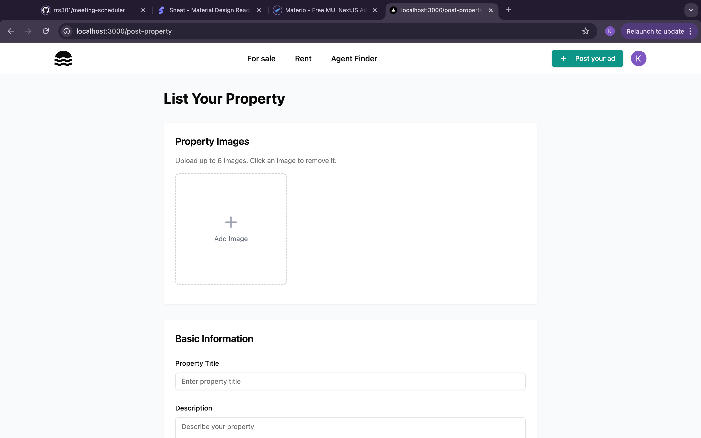

# 🏠 Real Estate Platform

A modern real estate platform built with Next.js, featuring property listings, interactive maps, user profiles, and secure authentication.

## ✨ Features

- 🏘️ Property Listings (Sale & Rent)
- 🗺️ Interactive Map Integration with OpenStreetMap
- 🔐 User Authentication with Clerk
- 📱 Responsive Design
- 🏷️ Advanced Property Filtering
- 📍 Location-based Search & Directions
- 💼 User Profiles & Property Management
- 📝 Property Posting System
- 📊 Distance Calculations
- 🎯 Route Planning & Navigation

## 🛠️ Tech Stack

- **Framework:** Next.js 14
- **Database:** Supabase
- **Styling:** Tailwind CSS
- **Authentication:** Clerk
- **Maps:** Leaflet with OpenStreetMap
- **UI Components:** shadcn/ui
- **Icons:** Lucide Icons
- **State Management:** React Hooks
- **Image Handling:** Next.js Image Optimization
- **Routing:** Next.js App Router

## 🚀 Getting Started

### Prerequisites

- Node.js (v18+ recommended)
- npm or yarn
- Clerk account for authentication
- Supabase database setup

### Environment Variables

```env
NEXT_PUBLIC_CLERK_PUBLISHABLE_KEY=your_clerk_publishable_key
CLERK_SECRET_KEY=your_clerk_secret_key
NEXT_PUBLIC_SUPABASE_URL=your_supabase_url
NEXT_PUBLIC_SUPABASE_ANON_KEY=your_supabase_anon_key
```

## 🔑 Key Features Explained

### Property Management
- Create, edit, and delete property listings
- Upload multiple property images
- Set property details (price, location, amenities)
- Track property views and inquiries

### User Profiles
- Personalized user dashboards
- Property management interface
- Profile customization
- Contact information management

### Map Features
- Interactive property locations
- Real-time distance calculations
- Route planning between locations
- Custom markers for properties
- Location-based property search

### Advanced Filtering
- Filter by property type
- Price range selection
- Number of bedrooms/bathrooms
- Parking availability
- Property size
- Location radius search

### Responsive Design
- Mobile-first approach
- Adaptive layout for all screen sizes
- Touch-friendly interface
- Optimized image loading

## 📱 Screenshots




## 👏 Acknowledgments

- [Next.js](https://nextjs.org/)
- [Clerk](https://clerk.dev/)
- [Supabase](https://supabase.com/)
- [Leaflet](https://leafletjs.com/)
- [shadcn/ui](https://ui.shadcn.com/)
- [Lucide Icons](https://lucide.dev/)


